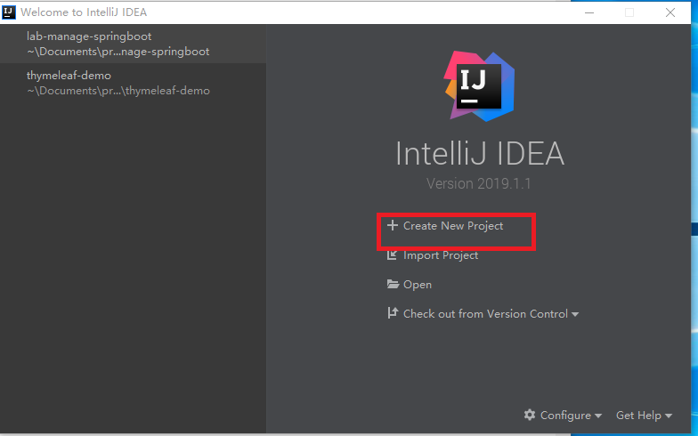
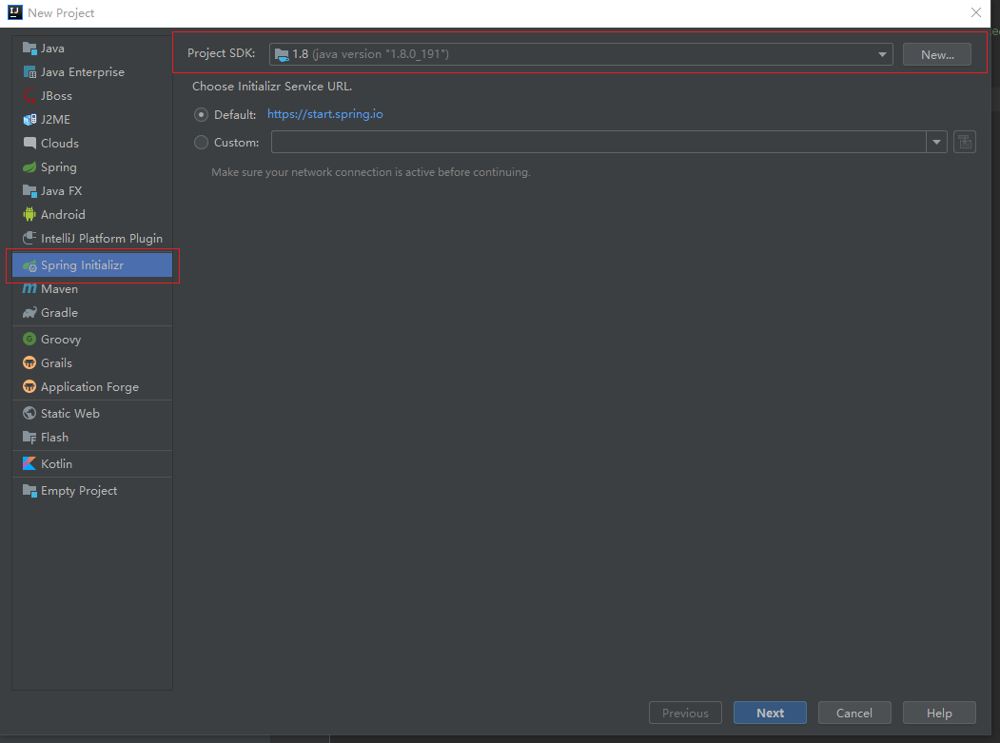
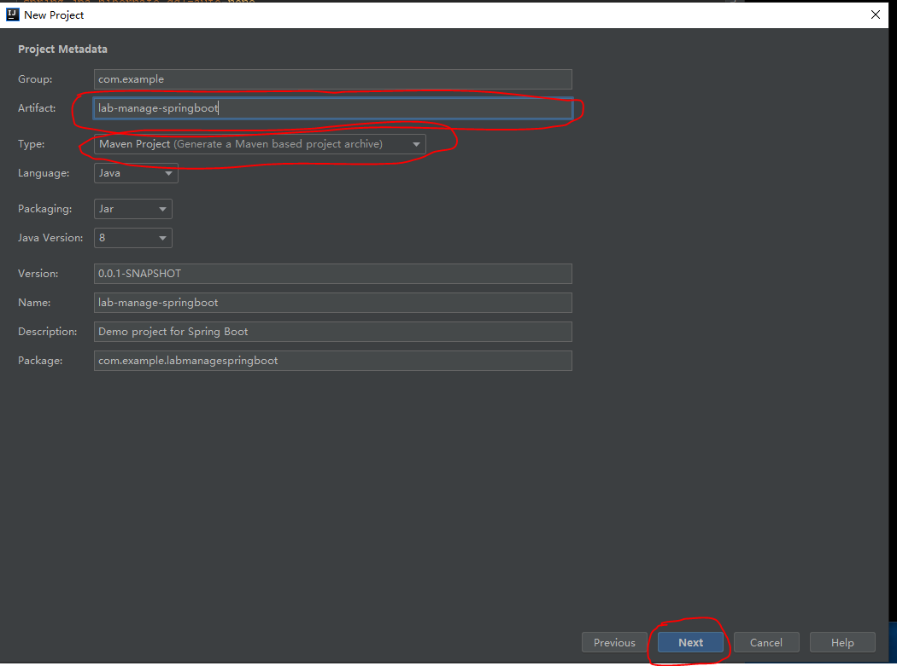
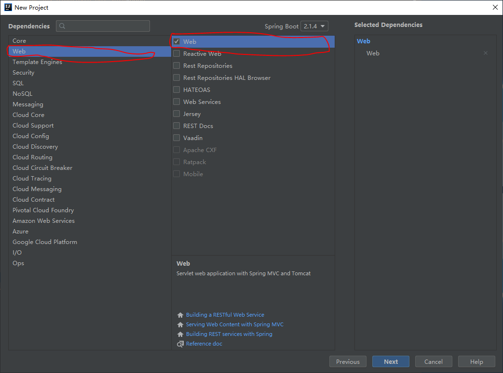
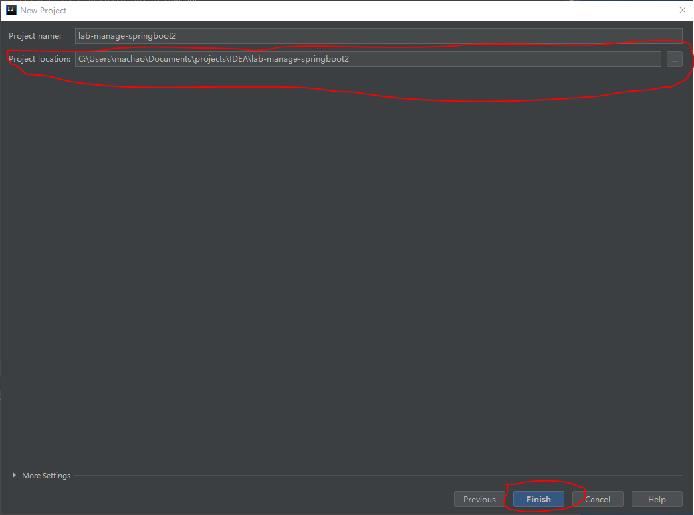
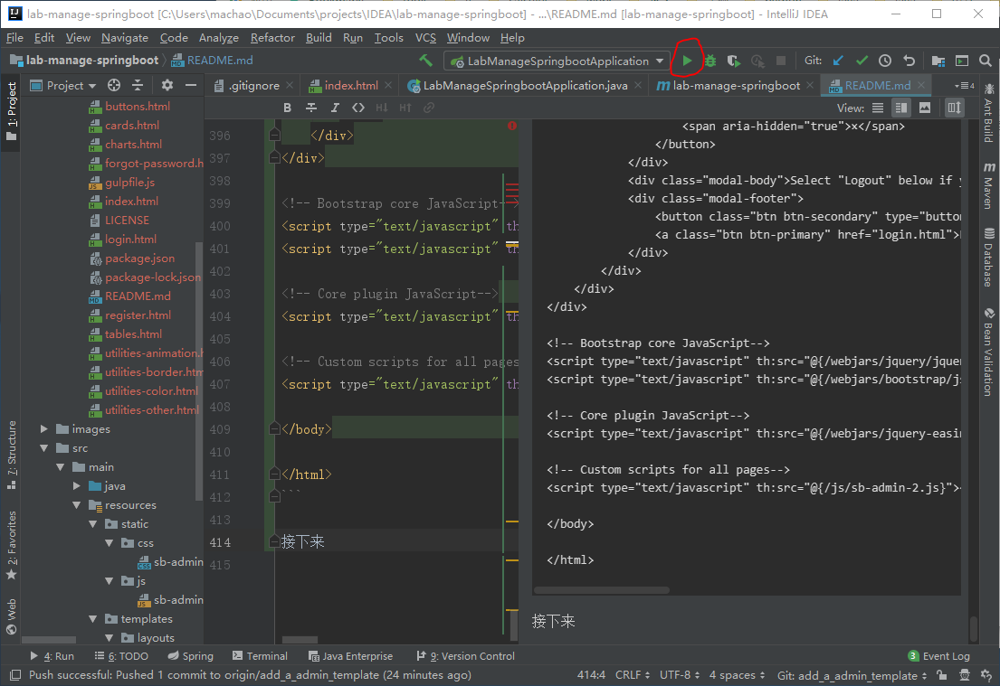
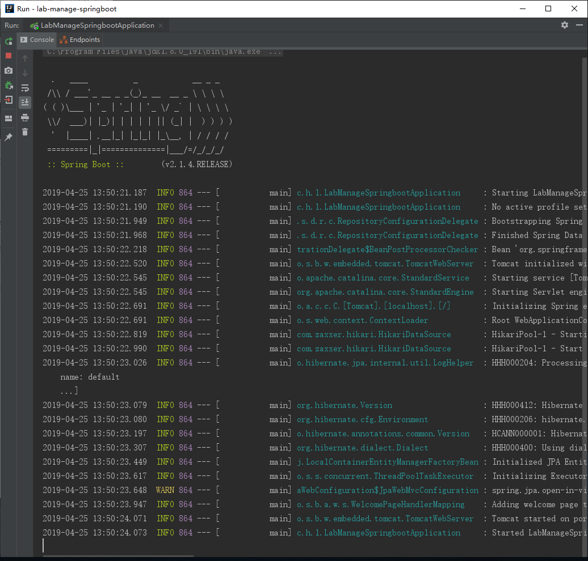
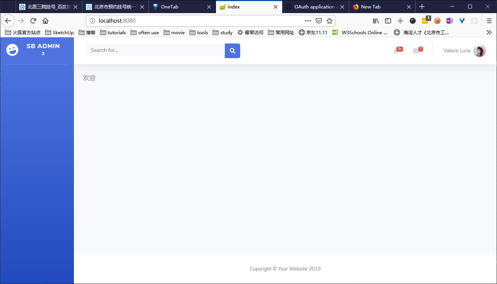

# lab_manage_spring_boot_springMvc
springboot 创建实验室设备检测系统

## 开发教程
## 创建项目
### 使用的工具：
* 操作系统：windows10系统
* JDK版本：jdk8
* 编码工具：IntelliJ IDEA

### IntelliJ IDEA创建项目
* 点击Create New Project按钮

* 选择Spring Initializr, 选择你的JDK（点击New），然后点击Next

* 填写Artifact选项，然后Type选项选择Maven, 点击Next

* 选择项目依赖的库
点击Web, 然后打勾Web

然后点击Template Engines, 打勾Thymeleaf; 然后点击SQL, 打勾JPA和MySQL, 最后点击Next
* 选择你想放的文件夹位置，然后finish


### 添加网页模板

* 首先选择模板

网上有很多开源的网页admin（管理）模板，我选择了[startbootstrap-sb-admin-2](https://github.com/BlackrockDigital/startbootstrap-sb-admin-2)

我把项目用的sb admin 2模板的文件压缩到了admin_template.zip文件，并加入到了git版本管理中。
你可以下载该[zip文件](https://github.com/haohaodehao/lab_manage_spring_boot_springMvc/raw/add_a_admin_template/admin_template.zip)。

* 向pom.xml添加模板文件的依赖库

```xml
        <dependency>
            <groupId>org.webjars</groupId>
            <artifactId>jquery</artifactId>
            <version>3.4.0</version>
        </dependency>
        <dependency>
            <groupId>org.webjars</groupId>
            <artifactId>bootstrap</artifactId>
            <version>4.3.1</version>
        </dependency>
        <dependency>
            <groupId>org.webjars</groupId>
            <artifactId>webjars-locator</artifactId>
            <version>0.32</version>
        </dependency>
        <dependency>
            <groupId>org.webjars</groupId>
            <artifactId>font-awesome</artifactId>
            <version>5.8.1</version>
        </dependency>
        <dependency>
            <groupId>org.webjars</groupId>
            <artifactId>jquery-easing</artifactId>
            <version>1.4.1</version>
        </dependency>
```
添加了jquery、bootstrap、webjars-locator、font-awesome、jquery-easing，webjars-locator库是springboot
框架需要的，并不是模板依赖的库。

然后我们再添加thymeleaf使用布局功能所依赖的库
```xml
<!-- and the 'Thymeleaf Layout Dialect'  -->
        <dependency>
            <groupId>nz.net.ultraq.thymeleaf</groupId>
            <artifactId>thymeleaf-layout-dialect</artifactId>
<!--            <version>1.3.1</version>-->
        </dependency>
```

* 添加模板依赖的css和js文件到项目

把模板zip文件解压，然后把模板文件目录css下的sb-admin-2.css移动到src/main/resources/static/css文件夹下（
如果你的项目没有这个目录的一些文件夹，你需要自己动手创建它们）。

把模板文件目录js下的sb-admin-2.js移动到
src/main/resources/static/js文件夹（如果你的项目没有这个目录的一些文件夹，你需要自己动手创建它们）。

* 创建layout文件(布局文件)和网站首页文件

在src/resources目录下新建templates文件夹

然后在templates文件夹创建index.html文件，并写入以下代码：

```html
<!DOCTYPE html>
<html
        xmlns:th="http://www.thymeleaf.org"
        xmlns:layout="http://www.ultraq.net.nz/thymeleaf/layout"
        layout:decorate="~{layouts/admin_layout}">

<head>
    <title>index</title>
    <meta name="description" content="index">
</head>

<body>
<div layout:fragment="contents">
    <P>欢迎</P>
    <div id="hello-text"></div>
</div>
</body>
</html>
```
代码中的 layout:fragment="contents"引入layout（布局）文件，代码layout:decorate="~{layouts/admin_layout}"
告诉程序布局文件是layouts文件夹的admin_layout.html文件，接着创建这个文件。

在src/resources文件夹下创建layouts文件夹，然后再layouts内创建admin_layout.html文件，写入：
```html
<!DOCTYPE html>
<html lang="zh-CN" xmlns="http://www.w3.org/1999/xhtml"
      xmlns:th="http://www.thymeleaf.org"
      xmlns:layout="http://www.w3.org/1999/xhtml">
<head>

    <meta charset="utf-8">
    <meta http-equiv="X-UA-Compatible" content="IE=edge">
    <meta name="viewport" content="width=device-width, initial-scale=1, shrink-to-fit=no">
    <meta name="description" content="">
    <meta name="author" content="">

    <title>SB Admin 2 - Dashboard</title>

    <!-- Custom fonts for this template-->
    <link rel="stylesheet" th:href="@{/webjars/font-awesome/5.8.1/css/all.css}">
    <link href="https://fonts.googleapis.com/css?family=Nunito:200,200i,300,300i,400,400i,600,600i,700,700i,800,800i,900,900i" rel="stylesheet">

    <!-- Custom styles for this template-->
    <link  rel="stylesheet" th:href="@{/css/sb-admin-2.css}">

</head>

<body id="page-top">

<!-- Page Wrapper -->
<div id="wrapper">

    <!-- Sidebar -->
    <ul class="navbar-nav bg-gradient-primary sidebar sidebar-dark accordion" id="accordionSidebar">

        <!-- Sidebar - Brand -->
        <a class="sidebar-brand d-flex align-items-center justify-content-center" href="index.html">
            <div class="sidebar-brand-icon rotate-n-15">
                <i class="fas fa-laugh-wink"></i>
            </div>
            <div class="sidebar-brand-text mx-3">SB Admin <sup>2</sup></div>
        </a>

        <!-- Divider -->
        <hr class="sidebar-divider my-0">

    </ul>
    <!-- End of Sidebar -->

    <!-- Content Wrapper -->
    <div id="content-wrapper" class="d-flex flex-column">

        <!-- Main Content -->
        <div id="content">

            <!-- Topbar -->
            <nav class="navbar navbar-expand navbar-light bg-white topbar mb-4 static-top shadow">

                <!-- Sidebar Toggle (Topbar) -->
                <button id="sidebarToggleTop" class="btn btn-link d-md-none rounded-circle mr-3">
                    <i class="fa fa-bars"></i>
                </button>

                <!-- Topbar Search -->
                <form class="d-none d-sm-inline-block form-inline mr-auto ml-md-3 my-2 my-md-0 mw-100 navbar-search">
                    <div class="input-group">
                        <input type="text" class="form-control bg-light border-0 small" placeholder="Search for..." aria-label="Search" aria-describedby="basic-addon2">
                        <div class="input-group-append">
                            <button class="btn btn-primary" type="button">
                                <i class="fas fa-search fa-sm"></i>
                            </button>
                        </div>
                    </div>
                </form>

                <!-- Topbar Navbar -->
                <ul class="navbar-nav ml-auto">

                    <!-- Nav Item - Search Dropdown (Visible Only XS) -->
                    <li class="nav-item dropdown no-arrow d-sm-none">
                        <a class="nav-link dropdown-toggle" href="#" id="searchDropdown" role="button" data-toggle="dropdown" aria-haspopup="true" aria-expanded="false">
                            <i class="fas fa-search fa-fw"></i>
                        </a>
                        <!-- Dropdown - Messages -->
                        <div class="dropdown-menu dropdown-menu-right p-3 shadow animated--grow-in" aria-labelledby="searchDropdown">
                            <form class="form-inline mr-auto w-100 navbar-search">
                                <div class="input-group">
                                    <input type="text" class="form-control bg-light border-0 small" placeholder="Search for..." aria-label="Search" aria-describedby="basic-addon2">
                                    <div class="input-group-append">
                                        <button class="btn btn-primary" type="button">
                                            <i class="fas fa-search fa-sm"></i>
                                        </button>
                                    </div>
                                </div>
                            </form>
                        </div>
                    </li>

                    <!-- Nav Item - Alerts -->
                    <li class="nav-item dropdown no-arrow mx-1">
                        <a class="nav-link dropdown-toggle" href="#" id="alertsDropdown" role="button" data-toggle="dropdown" aria-haspopup="true" aria-expanded="false">
                            <i class="fas fa-bell fa-fw"></i>
                            <!-- Counter - Alerts -->
                            <span class="badge badge-danger badge-counter">3+</span>
                        </a>
                        <!-- Dropdown - Alerts -->
                        <div class="dropdown-list dropdown-menu dropdown-menu-right shadow animated--grow-in" aria-labelledby="alertsDropdown">
                            <h6 class="dropdown-header">
                                Alerts Center
                            </h6>
                            <a class="dropdown-item d-flex align-items-center" href="#">
                                <div class="mr-3">
                                    <div class="icon-circle bg-primary">
                                        <i class="fas fa-file-alt text-white"></i>
                                    </div>
                                </div>
                                <div>
                                    <div class="small text-gray-500">December 12, 2019</div>
                                    <span class="font-weight-bold">A new monthly report is ready to download!</span>
                                </div>
                            </a>
                            <a class="dropdown-item d-flex align-items-center" href="#">
                                <div class="mr-3">
                                    <div class="icon-circle bg-success">
                                        <i class="fas fa-donate text-white"></i>
                                    </div>
                                </div>
                                <div>
                                    <div class="small text-gray-500">December 7, 2019</div>
                                    $290.29 has been deposited into your account!
                                </div>
                            </a>
                            <a class="dropdown-item d-flex align-items-center" href="#">
                                <div class="mr-3">
                                    <div class="icon-circle bg-warning">
                                        <i class="fas fa-exclamation-triangle text-white"></i>
                                    </div>
                                </div>
                                <div>
                                    <div class="small text-gray-500">December 2, 2019</div>
                                    Spending Alert: We've noticed unusually high spending for your account.
                                </div>
                            </a>
                            <a class="dropdown-item text-center small text-gray-500" href="#">Show All Alerts</a>
                        </div>
                    </li>

                    <!-- Nav Item - Messages -->
                    <li class="nav-item dropdown no-arrow mx-1">
                        <a class="nav-link dropdown-toggle" href="#" id="messagesDropdown" role="button" data-toggle="dropdown" aria-haspopup="true" aria-expanded="false">
                            <i class="fas fa-envelope fa-fw"></i>
                            <!-- Counter - Messages -->
                            <span class="badge badge-danger badge-counter">7</span>
                        </a>
                        <!-- Dropdown - Messages -->
                        <div class="dropdown-list dropdown-menu dropdown-menu-right shadow animated--grow-in" aria-labelledby="messagesDropdown">
                            <h6 class="dropdown-header">
                                Message Center
                            </h6>
                            <a class="dropdown-item d-flex align-items-center" href="#">
                                <div class="dropdown-list-image mr-3">
                                    
                                    <div class="status-indicator bg-success"></div>
                                </div>
                                <div class="font-weight-bold">
                                    <div class="text-truncate">Hi there! I am wondering if you can help me with a problem I've been having.</div>
                                    <div class="small text-gray-500">Emily Fowler · 58m</div>
                                </div>
                            </a>
                            <a class="dropdown-item d-flex align-items-center" href="#">
                                <div class="dropdown-list-image mr-3">
                                    
                                    <div class="status-indicator"></div>
                                </div>
                                <div>
                                    <div class="text-truncate">I have the photos that you ordered last month, how would you like them sent to you?</div>
                                    <div class="small text-gray-500">Jae Chun · 1d</div>
                                </div>
                            </a>
                            <a class="dropdown-item d-flex align-items-center" href="#">
                                <div class="dropdown-list-image mr-3">
                                    
                                    <div class="status-indicator bg-warning"></div>
                                </div>
                                <div>
                                    <div class="text-truncate">Last month's report looks great, I am very happy with the progress so far, keep up the good work!</div>
                                    <div class="small text-gray-500">Morgan Alvarez · 2d</div>
                                </div>
                            </a>
                            <a class="dropdown-item d-flex align-items-center" href="#">
                                <div class="dropdown-list-image mr-3">
                                    
                                    <div class="status-indicator bg-success"></div>
                                </div>
                                <div>
                                    <div class="text-truncate">Am I a good boy? The reason I ask is because someone told me that people say this to all dogs, even if they aren't good...</div>
                                    <div class="small text-gray-500">Chicken the Dog · 2w</div>
                                </div>
                            </a>
                            <a class="dropdown-item text-center small text-gray-500" href="#">Read More Messages</a>
                        </div>
                    </li>

                    <div class="topbar-divider d-none d-sm-block"></div>

                    <!-- Nav Item - User Information -->
                    <li class="nav-item dropdown no-arrow">
                        <a class="nav-link dropdown-toggle" href="#" id="userDropdown" role="button" data-toggle="dropdown" aria-haspopup="true" aria-expanded="false">
                            <span class="mr-2 d-none d-lg-inline text-gray-600 small">Valerie Luna</span>
                            
                        </a>
                        <!-- Dropdown - User Information -->
                        <div class="dropdown-menu dropdown-menu-right shadow animated--grow-in" aria-labelledby="userDropdown">
                            <a class="dropdown-item" href="#">
                                <i class="fas fa-user fa-sm fa-fw mr-2 text-gray-400"></i>
                                Profile
                            </a>
                            <a class="dropdown-item" href="#">
                                <i class="fas fa-cogs fa-sm fa-fw mr-2 text-gray-400"></i>
                                Settings
                            </a>
                            <a class="dropdown-item" href="#">
                                <i class="fas fa-list fa-sm fa-fw mr-2 text-gray-400"></i>
                                Activity Log
                            </a>
                            <div class="dropdown-divider"></div>
                            <a class="dropdown-item" href="#" data-toggle="modal" data-target="#logoutModal">
                                <i class="fas fa-sign-out-alt fa-sm fa-fw mr-2 text-gray-400"></i>
                                Logout
                            </a>
                        </div>
                    </li>

                </ul>

            </nav>
            <!-- End of Topbar -->

            <!-- Begin Page Content -->
            <div class="container-fluid">

                <div layout:fragment="contents"></div>
                <!-- /.container-fluid -->
            </div>

        </div>
        <!-- End of Main Content -->

        <!-- Footer -->
        <footer class="sticky-footer bg-white">
            <div class="container my-auto">
                <div class="copyright text-center my-auto">
                    <span>Copyright &copy; Your Website 2019</span>
                </div>
            </div>
        </footer>
        <!-- End of Footer -->

    </div>
    <!-- End of Content Wrapper -->

</div>
<!-- End of Page Wrapper -->

<!-- Scroll to Top Button-->
<a class="scroll-to-top rounded" href="#page-top">
    <i class="fas fa-angle-up"></i>
</a>

<!-- Logout Modal-->
<div class="modal fade" id="logoutModal" tabindex="-1" role="dialog" aria-labelledby="exampleModalLabel" aria-hidden="true">
    <div class="modal-dialog" role="document">
        <div class="modal-content">
            <div class="modal-header">
                <h5 class="modal-title" id="exampleModalLabel">Ready to Leave?</h5>
                <button class="close" type="button" data-dismiss="modal" aria-label="Close">
                    <span aria-hidden="true">×</span>
                </button>
            </div>
            <div class="modal-body">Select "Logout" below if you are ready to end your current session.</div>
            <div class="modal-footer">
                <button class="btn btn-secondary" type="button" data-dismiss="modal">Cancel</button>
                <a class="btn btn-primary" href="login.html">Logout</a>
            </div>
        </div>
    </div>
</div>

<!-- Bootstrap core JavaScript-->
<script type="text/javascript" th:src="@{/webjars/jquery/jquery.min.js}"></script>
<script type="text/javascript" th:src="@{/webjars/bootstrap/js/bootstrap.min.js}"></script>

<!-- Core plugin JavaScript-->
<script type="text/javascript" th:src="@{/webjars/jquery-easing/jquery.easing.min.js}"></script>

<!-- Custom scripts for all pages-->
<script type="text/javascript" th:src="@{/js/sb-admin-2.js}"></script>

</body>

</html>
```

接下来点击IDEA中的run图标运行项目


IDEA中的run选项卡的console应该打印这个

如果console下打印的log有任何的Error提示，说明你的代码里有问题。不要慌张，请根据Error信息提示，认真对照自己的代码和
我的代码（debug了这个Error）。

然后浏览器访问http://localhost:8080，应该看到如下画面


* 设置thymeleaf模板跟随改变更新页面。如果你对此不理解，直接照着做就行，
等做完了这个教程，再去看thymeleaf文档理解原因。

在src/resources/application.properties文件内写入
```
# Templates reloading during development
spring.thymeleaf.prefix=file:src/main/resources/templates/
spring.thymeleaf.cache=false

# Static resources reloading during development
spring.resources.static-locations=file:src/main/resources/static/
spring.resources.cache.period=0
```
src/resources/application.properties文件的改动需要重启项目以应用。